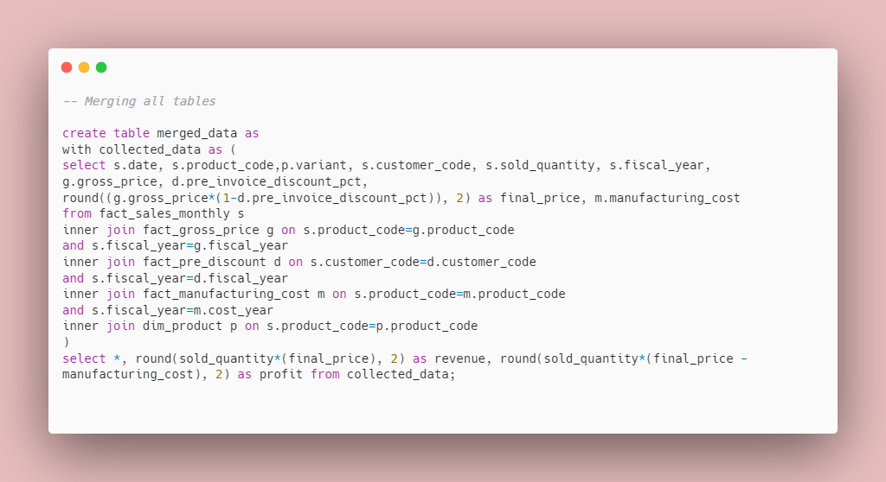
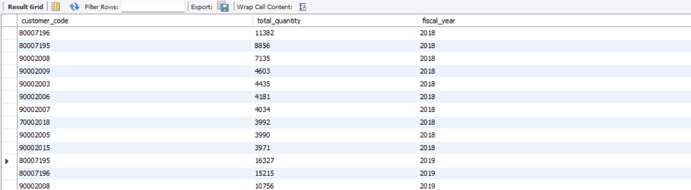

# SQL Data Analysis Project using Atliq Hardware sales data
This project leverages the power of MySQL Workbench to perform an in-depth sales analysis using data of Atliq Hardware Store's sales from 2017 to 2021 available on [Kaggle](https://www.kaggle.com/code/irnehred/sales-domain-data-analysis) and uses Microsoft's POWER BI to create a Sales Performance Dashboard.

# SQL Commands Used:
- CREATE TABLE
- CTEs
- LAG()
- AGGREGATION
- WHERE CLAUSE
- INNER JOIN
- SUBQUERIES
- OVER/PARTITION BY
- ROW_NUMBER (Window Function)

  
  

